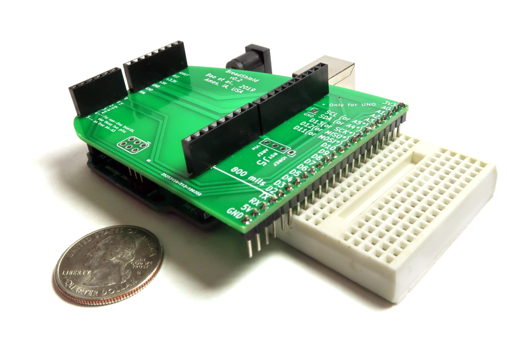

# BreadShield
The Arduino shield for breadboards

## Organization of files
* KiCAD: the KiCAD files of the PCB
* demo: programs and documentations for demos
* images: some images of BreadShield

## License
BreadShield (c) by Forrest Sheng Bao et al.

BreadShield is licensed under a
Creative Commons Attribution-ShareAlike 4.0 International License.

You should have received a copy of the license along with this
work. If not, see <http://creativecommons.org/licenses/by-sa/4.0/>.

A copy of this license is in the file `license.md`.

## Where to buy
* Crowd Supply https://www.crowdsupply.com/loser/breadshield
* ARMWorks (breadshield and breadboard kit, 1 or 3-pack) https://andahammer.com/index.php?route=product/product&path=68&product_id=299
